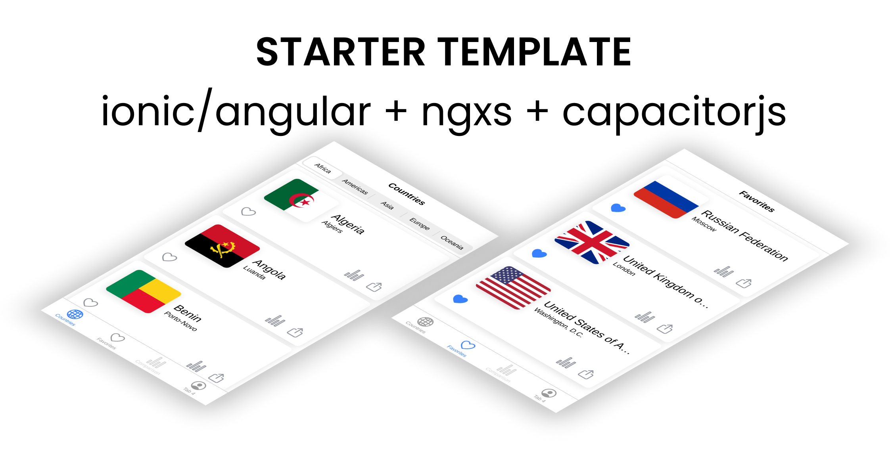

<p align="center"></p>

<h2 align="center">
  ionic/angular/ngxs/capacitorjs starter project
</h2>

<p align="center">
  Providing you with the components, templates, native components, ngrx, i18n, themes, auth pages and much more needed to build a mobile application on ionic framework.
</p>

<p align="center">
  <a href="https://gitpod.io/#https://github.com/thenaim/ionic-ngxs-capacitorjs-starter" target="_blank">
    
  </a>
</p>

# Getting started

```bash
git clone https://github.com/thenaim/ionic-ngxs-capacitorjs-starter myApp
cd myApp
npm i

# Build, before adding any native platforms
npx ionic build

# Add ios
npx cap add ios

# Add Android
npx cap add android
```

# Run with Capacitor

Open the IDE for a given native platform project

```bash
npx cap open ios
npx cap android ios
```

Run an Ionic project on a connected device

```bash
npx cap run
npx cap run android
npx cap run android -l --external
npx cap run ios --livereload --external
npx cap run ios --livereload-url=http://localhost:8100
```

For more information, check [ionic capacitorjs docs](https://ionicframework.com/docs/cli/commands/capacitor-run)

# Run in Browser

```bash
npx ionic serve

npx ionic serve --external
```

For more information, check [ionic serve docs](https://ionicframework.com/docs/cli/commands/serve)

# iOS Development

[ionic iOS Development docs](https://ionicframework.com/docs/developing/ios)

# Android Development

[ionic Android Development docs](https://ionicframework.com/docs/developing/android)

# Contributors

Want to start contributing to open source with ionic? Leave your mark and join the growing team of contributors!

Get started by checking out list of open [issues](https://github.com/thenaim/ionic-ngxs-capacitorjs-starter/issues) and reading [Contributor Guide](https://github.com/thenaim/ionic-ngxs-capacitorjs-starter/blob/master/CONTRIBUTING.md)

# License

License MIT (see the [LICENSE](https://github.com/thenaim/ionic-ngxs-capacitorjs-starter/blob/master/LICENSE) file for the full text)
